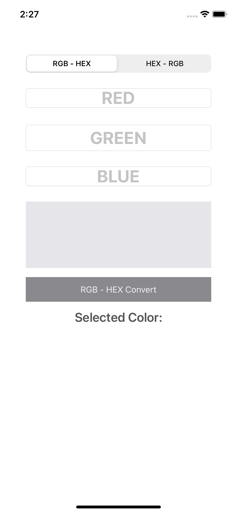
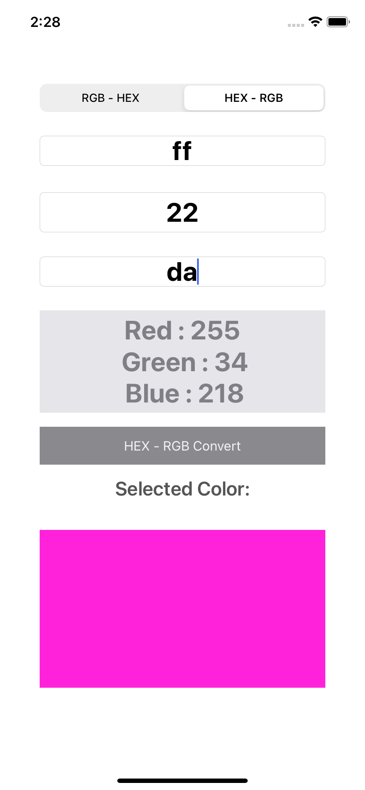

# RGB-HEX-Converter

RGB to Hex ve Hex to RGB dönüşümleri ile ilgili bir iOS uygulamasıdır.  
Kullanıcıdan alınan değerlere göre dönüşümler yapılmaktadır.  

  
## RGB to HEX conversion

Convert red color (255,0,0) to hex color code:  

R = (255)10 = (FF)16  
G = (0)10 = (00)16  
B = (0)10 = (00)16  
So the hex color code is:  
Hex = FF0000  

## HEX to RGB conversion

Convert gold hex color code FFD700 to RGB color: 

Hex = FFD700 
So the RGB colors are: 
R = (FF)16 = (255)10 
G = (D7)16 = (215)10 
B = (00)16 = (0)10 
OR 
RGB = (255, 215, 0) 

